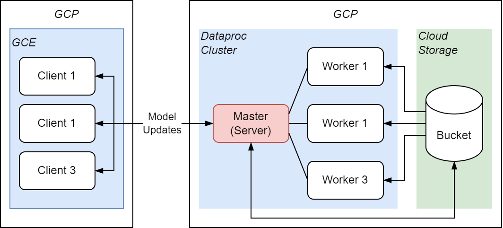

# Federated Learning for Flagging Hate Speech and Cyber-Bullying in Private Chats
Using distributed machine learning and federated learning techniques to preserve privacy when learning from personal data.

## Architecture


As can be seen in the diagram, the system consists of a server-client architecture. Their main components are described below;

**Server**

    Master Node: The master node serves an API for handling server-client communications. The API sends clients the current server model when requested, and receives finetuned models back from them. The master node also communicates with the worker nodes for model aggregation by the delegation of  MapReduce jobs. Additionally, the master node performs model evaluation and calculates performance scores for the aggregated models.
    
    Worker Nodes: The worker nodes handle the MapReduce jobs assigned to them by the master node.
    
    Storage Bucket: The storage bucket holds the current server model and all the corresponding client models. This bucket is accessible to all nodes on the cluster, although only the master nodes have write permission.

**Client**

    Client Node: The client nodes fetch copies of the server model from the master node and finetune these copies on the data they hold. Once finetuned, the client models are sent back to the server.

## Instructions

First create a cloud storage bucket `bdastorage` with the following layout, and copy all files from `app/master`, `app/tests` into `bdastorage/scripts`. Copy `configs.zip`, `fl.json` and the initial model into `bdastorage/models`. Copy the test split into `bdastorage/data`.


Now create a GCP cluster, using the command
```
gcloud dataproc clusters create bdacluster --region us-west1 --zone us-west1-b --master-machine-type e2-standard-2 --master-boot-disk-size 50 --num-workers 4 --worker-machine-type e2-standard-2 --worker-boot-disk-size 50 --image-version 2.1-debian11 --scopes 'https://www.googleapis.com/auth/cloud-platform' --tags bda-in,bda-out --initialization-actions 'gs://bdastorage/scripts/init_script.sh' --project <your_project_name>
```

The cluster will initialize with all the required python packages and the app in `/home/dataproc/fl_server`

To run, execute the following commands;
```
source setup.sh
sudo $PYSPARK_PYTHON app.py
```

## Documentation
You can find all relevant documentation in the docs folder of this repository.

